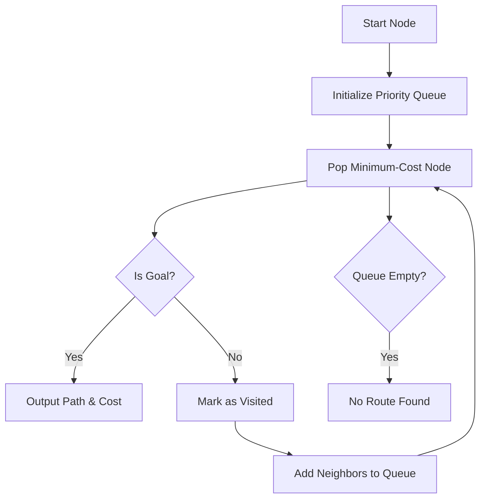
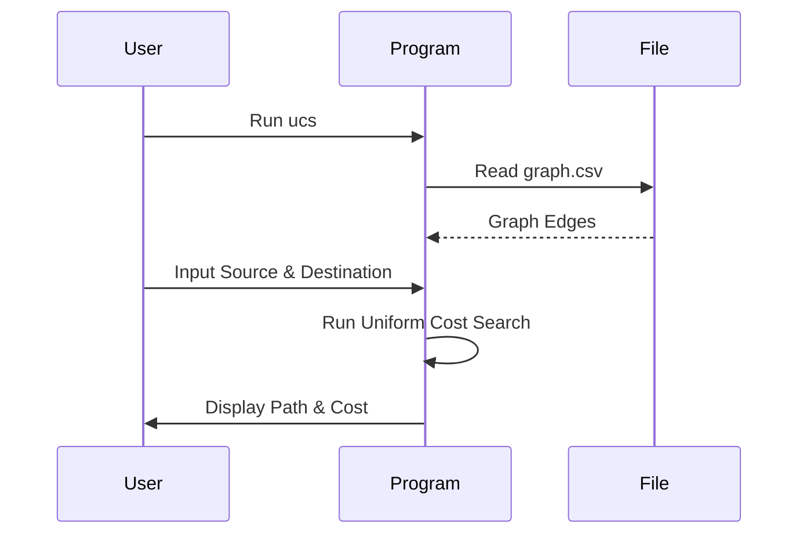

---

# Uniform Cost Search

[](https://en.wikipedia.org/wiki/C_(programming_language))
[](https://github.com/Rakshak-D/Uniform-cost-search/issues)
[](LICENSE)

A C-based implementation of the Uniform Cost Search (UCS) algorithm to find the optimal (minimum-cost) path between two nodes in a weighted graph, using a priority queue for efficient exploration.


---

## ✨ Key Features

### 🔍 Pathfinding
- Finds the shortest path (minimum total cost) between a source and destination node.
- Handles weighted, directed graphs loaded from a CSV file.
- Tracks and displays the full path from source to destination.

### 🧠 Priority Queue
- Custom priority queue implementation for efficient node selection.
- Sorts nodes by cumulative path cost to ensure optimal exploration.
- Supports dynamic path tracking for each node.

### 📄 Input/Output
- Reads graph data from a CSV file (format: source,destination,cost).
- Accepts user input for source and destination nodes.
- Outputs the optimal path and total cost, or a "no route found" message.

### ⚙️ Robustness
- Case-insensitive node name handling using `strcasecmp`.
- Error handling for file I/O and invalid inputs.
- Visited node tracking to prevent cycles and redundant exploration.

---

## 🚀 Quick Start

### Prerequisites
- C compiler (e.g., GCC)
- Standard C libraries (`stdio.h`, `stdlib.h`, `string.h`, `ctype.h`, `limits.h`)
- Graph data file: `graph.csv`

### Setup Instructions
```bash
# Clone repository
git clone https://github.com/Rakshak-D/Uniform-cost-search.git
cd Uniform-cost-search

# Compile the C program
gcc ucs.c -o ucs

# Run the program
./ucs
```

**Input Requirements:**
- Prepare a `graph.csv` file in the project root with the format:
  ```
  source,destination,cost
  A,B,4
  B,C,3
  A,C,8
  ```
- Run the program and enter the source and destination nodes when prompted.

**Example Run:**
```bash
Enter source: A
Enter destination: C
Optimal route cost from A to C: 7
Path: A -> B -> C
```

---

## 🌐 Project Overview

### Algorithm Diagram


### Execution Flow


---

## 🛠 Technology Stack

| Component       | Technologies                                |
|-----------------|--------------------------------------------|
| **Programming** | C (Standard Library)                       |
| **Data Input**  | CSV File Parsing                           |
| **Algorithm**   | Uniform Cost Search, Priority Queue        |
| **Dependencies**| stdio.h, stdlib.h, string.h, ctype.h       |

---

## 📂 Repository Structure

```
Uniform-cost-search/
├── ucs.c              # Main C program implementing UCS
├── graph.csv          # Sample graph data 
├── README.md          # Project documentation
├── LICENSE            # MIT License
└── .gitignore         # Git ignore file
```

---

## 📝 Core Dependencies

- Standard C libraries (included with any C compiler):
  - `stdio.h` (file I/O and console output)
  - `stdlib.h` (memory management)
  - `string.h` (string operations)
  - `ctype.h` (character handling)
  - `limits.h` (integer limits)

No external libraries required.

---

## 🐛 Issue Reporting

[](https://github.com/Rakshak-D/Uniform-cost-search/issues)

**Bug Report Template:**
```markdown
## Description
[Describe the issue clearly]

## Reproduction Steps
1. Run program...
2. Input source/destination...
3. Observe...

**Expected Behavior**
[What should happen]

**Actual Behavior**
[What actually happens]

**Environment**
- OS: [e.g., Ubuntu 22.04]
- Compiler: [e.g., GCC 11.4]
- Input File: [e.g., graph.csv contents]

**Additional Context**
[Screenshots, error messages]
```

**Issue Labels**
- `bug` - Code or output errors
- `enhancement` - New feature requests
- `documentation` - README or comment improvements

---

## 📜 License

This project is licensed under the MIT License - see [LICENSE](LICENSE) for details.

---

## 📬 Contact & Support

**Project Maintainer**  
Rakshak D  
📧 rakshakmce@gmail.com  
🔗 [GitHub Profile](https://github.com/Rakshak-D)

---

## 🛠️ Development Roadmap

### Next Milestones
- Add support for weighted undirected graphs
- Implement graph visualization (e.g., output to Graphviz)
- Add command-line arguments for source/destination
- Enhance error handling for malformed CSV files

### Contribution Guide
1. Fork the repository.
2. Create a feature branch (`git checkout -b feature/new-functionality`).
3. Commit changes (`git commit -m 'Add new functionality'`).
4. Push to branch (`git push origin feature/new-functionality`).
5. Open a Pull Request.

**Code Standards**
- Follow ANSI C conventions.
- Include clear comments for functions and logic.
- Ensure portability across compilers.
- Test with sample `graph.csv` files.

---

